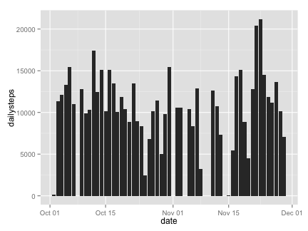
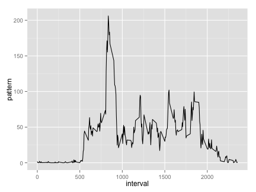
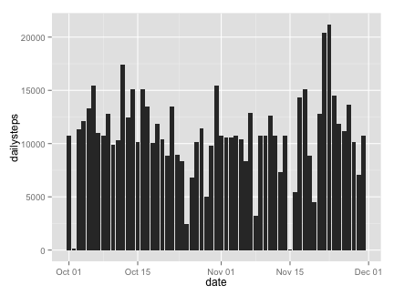
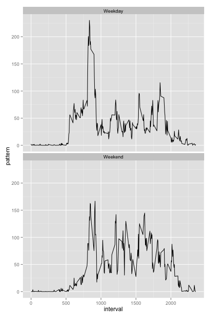

# Reproducible Research: Peer Assessment 1

## Introduction

It is now possible to collect a large amount of data about personal movement using activity monitoring devices such as a [Fitbit](http://www.fitbit.com/home), [Nike Fuelband](http://www.nike.com/us/en_us/c/nikeplus-fuelband), or [Jawbone Up](https://jawbone.com/up). These type of devices are part of the “quantified self” movement – a group of enthusiasts who take measurements about themselves regularly to improve their health, to find patterns in their behavior, or because they are tech geeks. But these data remain under-utilized both because the raw data are hard to obtain and there is a lack of statistical methods and software for processing and interpreting the data.

This assignment makes use of data from a personal activity monitoring device. This device collects data at 5 minute intervals through out the day. The data consists of two months of data from an anonymous individual collected during the months of October and November, 2012 and include the number of steps taken in 5 minute intervals each day.

## Data

The data for this assignment can be downloaded from the course web site:

- Dataset: [Activity monitoring data](https://d396qusza40orc.cloudfront.net/repdata%2Fdata%2Factivity.zip) [52K]

The variables included in this dataset are:

- steps: Number of steps taking in a 5-minute interval (missing values are coded as NA)

- date: The date on which the measurement was taken in YYYY-MM-DD format

- interval: Identifier for the 5-minute interval in which measurement was taken

The dataset is stored in a comma-separated-value (CSV) file and there are a total of 17,568 observations in this dataset.

## Loading and preprocessing the data
Simply read the data using "read.csv". Transform the "date" column into DateTime class. I also transform the dataframe to data.table which is more comvenient to manipulate data.


```r
activity_data <- read.csv("data/activity.csv")
activity_data$date <- as.Date(activity_data$date, "%Y-%m-%d")

library(data.table)
activity_data <- data.table(activity_data)
# head(activity_data)
```


## What is mean total number of steps taken per day?
Since "activity" data is already in data.table format, we can use the following command to count the total steps on each day. Some rows with missing values are removed.


```r
daily_steps <- activity_data[complete.cases(activity_data), list(dailysteps = sum(steps)), 
    by = date]
```


Make a histogram of the total number of steps taken each day, use ggplot2 plotting system.


```r
library(ggplot2, quietly = TRUE)
ggplot(daily_steps, aes(x = date, y = dailysteps)) + geom_bar(stat = "identity")
```

 


Calculate and report the mean and median total number of steps taken per day.


```r
mean(daily_steps$dailysteps, na.rm = TRUE)
```

```
## [1] 10766
```

```r
median(daily_steps$dailysteps, na.rm = TRUE)
```

```
## [1] 10765
```


## What is the average daily activity pattern?
In this case, we can also use data.table to compute the average daily activity patterns. Note that rows with missing values are ignored.


```r
activity_pattern <- activity_data[complete.cases(activity_data), list(pattern = mean(steps)), 
    by = interval]
```


Use `geom_line()` and ggplot system to make a time series plot of the 5-minute interval (x-axis) and the average number of steps taken, averaged across all days (y-axis).


```r
ggplot(activity_pattern, aes(x = interval, y = pattern)) + geom_line()
```

 


Get the interval that contain the maximum number of steps.


```r
activity_pattern$interval[which.max(activity_pattern$pattern)]
```

```
## [1] 835
```


## Imputing missing values
Compute the total number of rows with missing values `NA`.


```r
sum(!complete.cases(activity_data))
```

```
## [1] 2304
```


First, I realized that steps is the only variable that has missing values. So we only need to fill in missing valies of this variable. I decided to fill in missing values in dataset using the mean for the 5-minute interval. First I need to make a copy of the original activity_data. Then I will use data.table assignment by reference and use ifelse function to assign missing values.


```r
activity_data_nafill <- copy(activity_data)
activity_data_nafill <- activity_data_nafill[, `:=`(nafillsteps, ifelse(is.na(steps), 
    mean(steps, na.rm = TRUE), steps)), by = interval]
activity_data_nafill[, `:=`(steps, NULL)]
```

```
##              date interval nafillsteps
##     1: 2012-10-01        0     1.71698
##     2: 2012-10-01        5     0.33962
##     3: 2012-10-01       10     0.13208
##     4: 2012-10-01       15     0.15094
##     5: 2012-10-01       20     0.07547
##    ---                                
## 17564: 2012-11-30     2335     4.69811
## 17565: 2012-11-30     2340     3.30189
## 17566: 2012-11-30     2345     0.64151
## 17567: 2012-11-30     2350     0.22642
## 17568: 2012-11-30     2355     1.07547
```

```r
setnames(activity_data_nafill, "nafillsteps", "steps")
```


Finally, make the histogram plot and compute the mean and medium.


```r
daily_steps_nafill <- activity_data_nafill[, list(dailysteps = sum(steps)), 
    by = date]
ggplot(daily_steps_nafill, aes(x = date, y = dailysteps)) + geom_bar(stat = "identity")
```

 

```r
mean(daily_steps_nafill$dailysteps)
```

```
## [1] 10766
```

```r
median(daily_steps_nafill$dailysteps)
```

```
## [1] 10766
```


From my observation, the mean of daily steps is unchanged. However, the median is different. This is expected since I fill the missing values with mean activity in each interval. The number days with step values are now larger which can change the distribution of daily setps.

## Are there differences in activity patterns between weekdays and weekends?

First create a new factor variable indicating whether a given day is on weekdays or not. Separately compute the average daily activity patterns for weekday and weelend.


```r
activity_data_nafill[, `:=`(is.weekday, ifelse(weekdays(date) %in% c("Saturday", 
    "Sunday"), "Weekend", "Weekday"))]
```

```
##              date interval   steps is.weekday
##     1: 2012-10-01        0 1.71698    Weekday
##     2: 2012-10-01        5 0.33962    Weekday
##     3: 2012-10-01       10 0.13208    Weekday
##     4: 2012-10-01       15 0.15094    Weekday
##     5: 2012-10-01       20 0.07547    Weekday
##    ---                                       
## 17564: 2012-11-30     2335 4.69811    Weekday
## 17565: 2012-11-30     2340 3.30189    Weekday
## 17566: 2012-11-30     2345 0.64151    Weekday
## 17567: 2012-11-30     2350 0.22642    Weekday
## 17568: 2012-11-30     2355 1.07547    Weekday
```

```r
activity_data_nafill[, `:=`(is.weekday, as.factor(weekday))]
```

```
## Error: object 'weekday' not found
```

```r
activity_pattern_nafill <- activity_data_nafill[, list(pattern = mean(steps)), 
    by = list(interval, is.weekday)]
```


Make two separate activity pattern plot for weekday and weekend.


```r
ggplot(activity_pattern_nafill, aes(x = interval, y = pattern)) + geom_line() + 
    facet_wrap(~is.weekday, nrow = 2)
```

 

